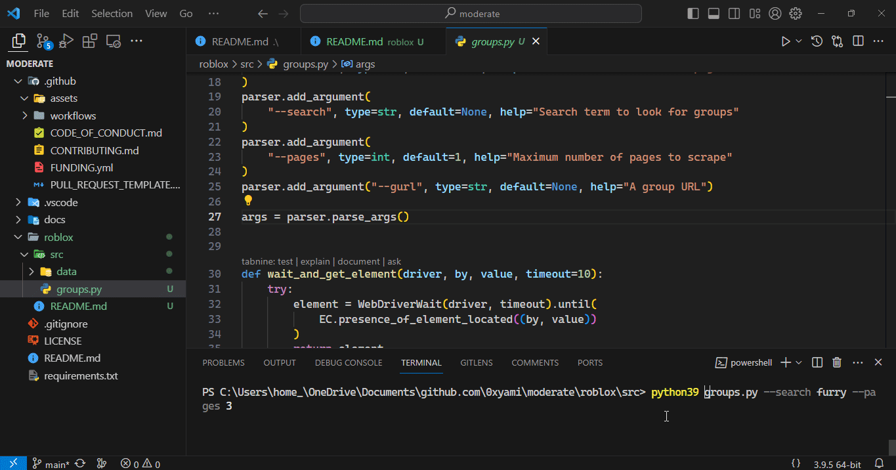
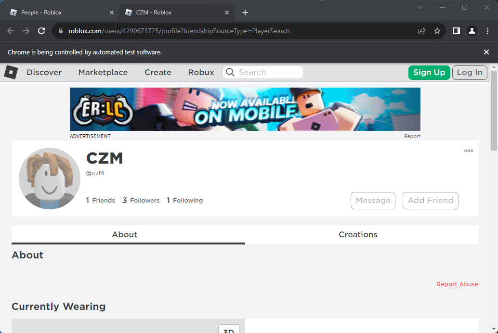

# Roblox

## `group.py` - Web Scraping Script for Roblox Groups



### Command-line Arguments

- `--timeout`: Time to wait for a page to load (default: 10 seconds).
- `--search`: Search term to look for groups.
- `--pages`: Maximum number of pages to scrape (default: 1).
- `--gurl`: A specific group URL to scrape.

### Functions

1. `wait_and_get_element(driver, by, value, timeout=10)`
    - Waits for an element specified by the `by` and `value` parameters to be present on the page.
    - Returns the located element or `None` if it times out.

2. `click_element_safely(element)`
    - Safely attempts to click on a given element, handling potential exceptions.

3. `move_to_position(driver, web_element, up=0, down=0)`
    - Scrolls the browser window to a specific position relative to the provided web element.

4. `scrape_group_details(driver, group_url, standalone=False)`
    - Scrapes details of a specific Roblox group identified by its URL.
    - Saves group details, including description, and member information to files.

5. `scrape_groups(url="https://www.roblox.com/search/groups")`
    - Scrapes Roblox groups from the specified URL or the default search URL.
    - Iterates through pages, extracts group information, and calls `scrape_group_details` for each group.

6. `main()`
    - Main function that determines whether to scrape groups or a specific group based on command-line arguments.

### Execution

1. Parsing Command-line Arguments
    - The script uses the `argparse` module to parse command-line arguments.

2. Web Scraping Initialization
    - Initializes a Chrome WebDriver for web scraping.

3. Searching for Groups
    - If `--search` is provided, the script searches for groups and iterates through pages.
    - Extracts group information such as name, URL, and access status.
    - Calls `scrape_group_details` for each group.

4. Scraping Group Details
    - `scrape_group_details` function opens the group URL, retrieves group details and saves them to files.

5. Closing the WebDriver
    - If `--autoclose` is provided, the WebDriver is closed after scraping.

6. Main Execution
    - Invokes the `main` function to start the script.

### Notes

- The script uses Selenium to automate browser actions, and BeautifulSoup for HTML parsing.
- Error handling is implemented to manage exceptions during web scraping.

### Usage Example

```bash
python group.py --search "Roblox Dev" --pages 3
```


## `users.py` - Web Scraping Script for Roblox Users



### Command-line Arguments

- `--timeout`: Time to wait for a page to load (default: 10 seconds).
- `--search`: Search term to look for users.
- `--user`: A specific user URL to scrape.
- `--icapture`: Capture the 3D Avatar on the user's profile.
- `--capture-page`: Screenshot the full user profile.
- `--file`: Import a members.txt file for processing. ([MembersFile](https://github.com/0xYami/moderate/wiki/MembersFile))

### Functions

1. `wait_and_get_element(driver, by, value, timeout=10)`
    - Waits for an element specified by the `by` and `value` parameters to be present on the page.
    - Returns the located element or `None` if it times out.

2. `click_element_safely(element)`
    - Safely attempts to click on a given element, handling potential exceptions.

3. `get_counts(soup)`
    - Retrieves various counts (e.g., friends, followers) from the user's profile.

4. `move_to_position(driver, web_element, up=0, down=0)`
    - Scrolls the browser window to a specific position relative to the provided web element.

5. `capture_3d_avatar(driver, path)`
    - Captures the 3D avatar of the user and saves it as a GIF.

6. `download_avatar(avatar_url, directory)`
    - Downloads the user's avatar image.

7. `capture_page(driver, path)`
    - Captures a screenshot of the full user profile.

8. `scrape_details(driver, user_url, username, standalone=False)`
    - Scrapes details of a specific Roblox user identified by their URL.
    - Saves user details, including name, display name, counts, and optional 3D avatar and profile screenshot.

9. `scrape_users(url="https://www.roblox.com/search/users")`
    - Scrapes Roblox users from the specified URL or the default search URL.
    - Iterates through pages, extracts user information, and calls `scrape_details` for each user.

### Execution

1. Parsing Command-line Arguments
    - The script uses the `argparse` module to parse command-line arguments.

2. Web Scraping Initialization
    - Initializes a Chrome WebDriver for web scraping.

3. Searching for Users
    - If `--search` is provided, the script searches for users and iterates through pages.
    - Extracts user information such as name, display name, and profile link.
    - Calls `scrape_details` for each user.

4. Scraping User Details
    - `scrape_details` function opens the user URL, retrieves user details, and saves them to files.

5. Closing the WebDriver
    - If `--autoclose` is provided, the WebDriver is closed after scraping.

6. Main Execution
    - Invokes the `main` function to start the script.

### Notes

- The script uses Selenium to automate browser actions, BeautifulSoup for HTML parsing, and imageio for handling images.
- Error handling is implemented to manage exceptions during web scraping.

### Usage Example

```bash
python users.py --search "Roblox Dev"
```

```bash
python users.py --user "https://www.roblox.com/users/12345678/profile"
```

```bash
python users.py --file "members.txt"
```